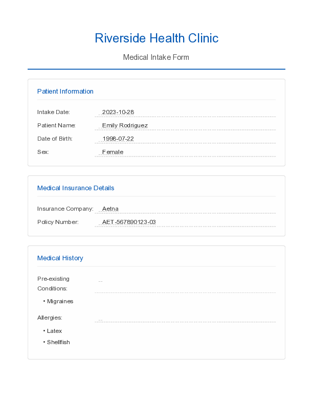
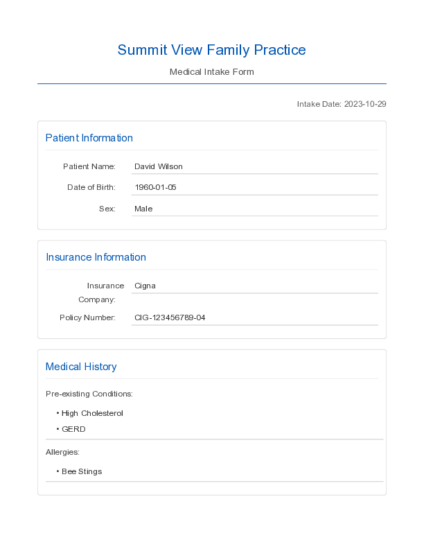
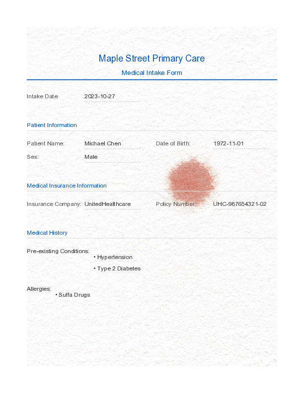
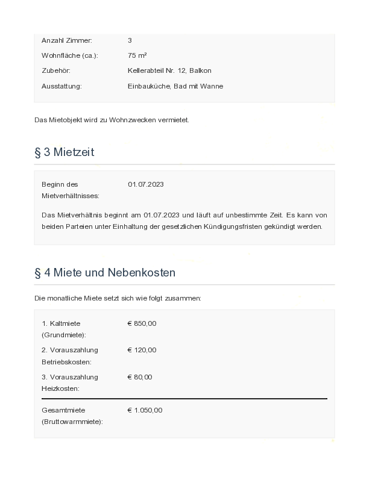
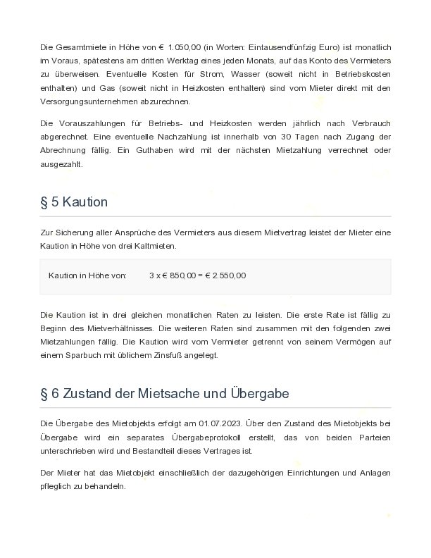
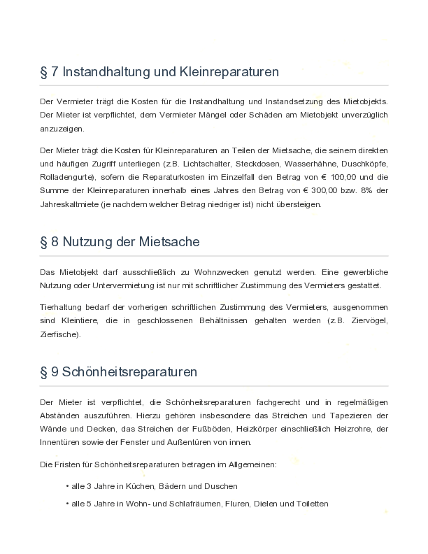
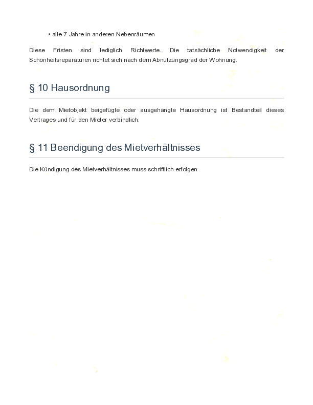
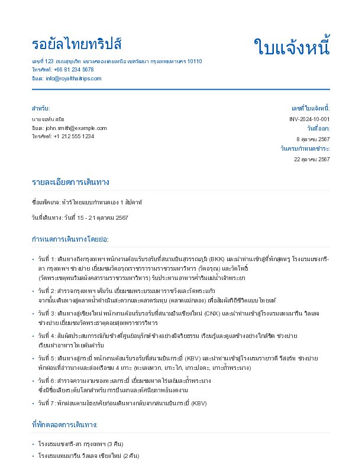
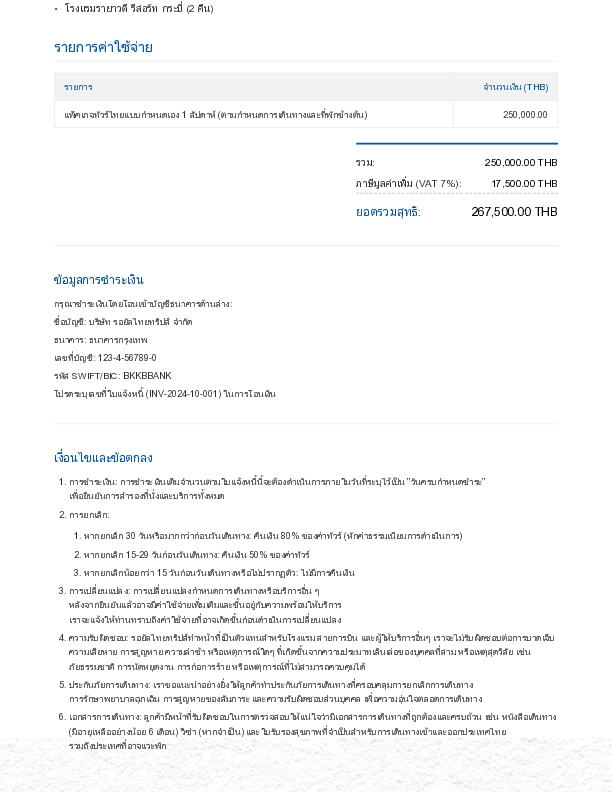

<div align="left"><sup><i>Watanabe, the hero of Akira Kurosawa's Ikiru, as edited by Qwen2.5-Max.</i></sup></div>

# Bureaucrat:
## A Multilingual Synthetic Business Document Generator

When working with document AI applications, it is useful to be able to generate synthetic business documents. 

With minimal prompting, *Bureaucrat* generates documents, such as invoices, contracts, agreements, business forms, and so on, in different languages, with rich layouts, while taking language and cultural context into account.

*Bureaucrat* operates in two modes: 

(1) In `generate` mode, you specify what types of documents you desire, and the system comes up with with the document designs and data for you.

(2) In `clone` mode, you specify an existing business document, and the system attempts to "clone" that document: It identifies private data in that document, replaces private data with synthetic data, but keeps close to the original document's design.

## Generating Synthetic Business Documents

The following command results in 10 medical intake form PDFs, with each form having different layouts and different data:

```
./generate \
 -t "Medical intake form for a primary care doctor office" \
 -c 3
 -e "medical office name," \
     "intake date," \
     "patient name," \
     "patient date of birth," \    
     "patient sex," \
     "medical insurance company name," \
     "insurance policy number," \
     "list of prexisting conditions," \ 
     "list of allergies" \
```

`-t` allows you to specify what to generate (the document type),

`-c` is the number of unique documents to generate,

`-e` let's you list the data items you want to include in the documents. Synthetic values for those items will be generated by an LLM.

The result of this pipeline is 3 PDF documents for a medical office intake form:

<table>
<tr>
<td></td>
<td></td>
<td></td>
</tr>
</table>

The last document illustrates the ability to render document backgrounds that mimic scanned or photographed paper documents. (In this case, perhaps the office was a bit hasty with blood samples...)

For each document, you get a data file, which is useful in supervised training situations:

```
{
    "intake_date": "2023-10-26",
    "patient_name": "Emily Johnson",
    "date_of_birth": "1985-03-15",
    "sex": "Female",
    "insurance_company": "Blue Cross Blue Shield",
    "policy_number": "BCBS87654321A",
    "pre_existing_conditions": "Mild Asthma, Seasonal Allergies",
    "allergies": "Penicillin",
    "_document_type": "Medical Intake Form",
    "_language": "en"
  }
```

## Multilingual Examples

You can generate documents in other languages. The following generates 5 unique German apartment rental agreements:

```
./generate \
  -t "Wohnungsmietvertrag" \ 
  -c 5 \
  -l de \
  -e "Vermieter Name,"\
     "Vermieter Addresse,"\ 
     "Mieter Name,"\ 
     "Mieter Addresse,"\
     "Mieter Geburtsdatum,"\ 
     "Miete pro Monat,"\
     "Beginn des Mietverhältnisses"\
  -I "Generate and include other data items "\
      "as appropriate for a rental agreement in Germany. "\
      "Include legal language appropriate for a German " \
      "apartment rental agreement, including language required " \
      "in the jurisdiction specified in the data."
```

<table>
<tr>
<td></td>
<td></td>
<td></td>
</tr>
<tr>
<td></td>
<td></td>
<td></td>
</tr>
</table>

`-l` specifies the desired language;

`-I` specify optional instructions to the LLM -- in this case, to include legal language appropriate for a German apartment rental agreement. Mix-and-match of languages is supported, based on the underlying LLM's capabilities.

The resulting generated data is region-appropriate, such as using German(-sounding) names, German addresses, currency formatting, phone numbers, and emails. The rental amount is also in a realistic range:

```
{
    "filename": "wohnungsmietvertrag_0001.html",
    "document_type": "Wohnungsmietvertrag",
    "language": "de",
    "entity_data": {
      "Vermieter Name": "Immobilienverwaltung Schmidt GmbH",
      "Vermieter Addresse": "Hauptstraße 123, 10115 Berlin, Deutschland",
      "Mieter Name": "Anna Müller",
      "Mieter Addresse": "Goethestraße 5a, 10117 Berlin, Deutschland",
      "Mieter Geburtsdatum": "15.03.1992",
      "Telefonnummer des Mieters": "+49 176 12345678",
      "E-Mail des Mieters": "anna.mueller@email.de",
      "Miete pro Monat": "850,00 €",
      "Beginn des Mietverhältnisses": "01.08.2024",
      "_document_type": "Wohnungsmietvertrag",
      "_language": "de"
    }
  }
```

Non-Latin character sets are also supported. The following generates an invoice for a custom one-week tour of Thailand:

```
./generate \
 -t "An invoice for a 1-week custom tour of Thailand" \
 -c 1 \
 -l th \
 -I "Include legal text in Thai that is appropriate " \
    "and customary for custom tour package in Thailand" \
 -e "Thai tour company name,"\
    "tour company address, "\
    "tour company phone number, "\
    "tour company email, "\
    "American customer name, "\
    "American customer email, "\
    "American customer phone, "\
    "tour dates, "\
    "tour itinerary, "\
     list of accommodations in the tour"
```

<table>
<tr>
<td></td>
<td></td>
</tr>
</table>

The years are stated in the Buddhist year, customary in Thai business documents, Thai names and addresses are used, and the tour cost reflects a realistic amount in Thai baht.

```
{
    "filename": "an_invoice_for_a_1_week_custom_tour_of_thailand_0001.html",
    "document_type": "An invoice for a 1-week custom tour of Thailand",
    "language": "th",
    "entity_data": {
      "Thai tour company name": "รอยัลไทยทริปส์",
      "tour company address": "เลขที่ 123 ถนนสุขุมวิท แขวงคลองเตยเหนือ เขตวัฒนา กรุงเทพมหานคร 10110",
      "tour company phone number": "+66 81 234 5678",
      "tour company email": "info@royalthaitrips.com",
      "American customer name": "นายจอห์น สมิธ",
      "American customer email": "john.smith@example.com",
      "American customer phone": "+1 212 555 1234",
      "tour dates": "วันที่ 15 - 21 ตุลาคม 2567",
      "tour itinerary": "วันที่ 1: เดินทางถึงกรุงเทพฯ พนักงานต้อนรับรอรับที่สนามบินสุวรรณภูมิ (BKK) และนำท่านเข้าสู่ที่พักสุดหรู โรงแรมแชงกรี-ลา กรุงเทพฯ ช่วงบ่าย เยี่ยมชมวัดอรุณราชวรารามราชวรมหาวิหาร (วัดอรุณ) และวัดโพธิ์ (วัดพระเชตุพนวิมลมังคลารามราชวรมหาวิหาร) รับประทานอาหารค่ำริมแม่น้ำเจ้าพระยา\nวันที่ 2: สำรวจกรุงเทพฯ เต็มวัน เยี่ยมชมพระบรมมหาราชวังและวัดพระแก้ว จากนั้นเดินทางสู่ตลาดน้ำดำเนินสะดวกและตลาดร่มหุบ (ตลาดแม่กลอง) เพื่อสัมผัสวิถีชีวิตแบบไทยแท้\nวันที่ 3: เดินทางสู่เชียงใหม่ พนักงานต้อนรับรอรับที่สนามบินเชียงใหม่ (CNX) และนำท่านเข้าสู่โรงแรมแทมมารีน วิลเลจ ช่วงบ่าย เยี่ยมชมวัดพระธาตุดอยสุเทพราชวรวิหาร\nวันที่ 4: สัมผัสประสบการณ์กับช้างที่ศูนย์อนุรักษ์ช้างอย่างมีจริยธรรม เรียนรู้และดูแลช้างอย่างใกล้ชิด ช่วงบ่าย เรียนทำอาหารไทยต้นตำรับ\nวันที่ 5: เดินทางสู่กระบี่ พนักงานต้อนรับรอรับที่สนามบินกระบี่ (KBV) และนำท่านเข้าสู่โรงแรมรายาวดี รีสอร์ท ช่วงบ่าย พักผ่อนที่อ่าวนางและล่องเรือชม 4 เกาะ (ทะเลแหวก, เกาะไก่, เกาะปอดะ, เกาะถ้ำพระนาง)\nวันที่ 6: สำรวจความงามของทะเลกระบี่ เยี่ยมชมหาดไร่เลย์และถ้ำพระนาง ซึ่งมีชื่อเสียงระดับโลกสำหรับการปีนผาและทัศนียภาพอันงดงาม\nวันที่ 7: พักผ่อนตามอัธยาศัยก่อนเดินทางกลับจากสนามบินกระบี่ (KBV)",

      "list of accommodations in the tour": [
        "โรงแรมแชงกรี-ลา กรุงเทพฯ (3 คืน)",
        "โรงแรมแทมมารีน วิลเลจ เชียงใหม่ (2 คืน)",
        "โรงแรมรายาวดี รีสอร์ท กระบี่ (2 คืน)"
      ],
      "_document_type": "An invoice for a 1-week custom tour of Thailand",
      "_language": "th"
    }
  }
```

## Clone and Anonymize Existing Business Documents

In `clone` mode you can take an existing business document, possibly containing sensitive PII data, and: 

* Replace the PII data with synthetic data
* Clone the layout of the existing document
* Following that layout, generate new documents from the existing document, but based on the synthetically generated data.

For example, suppose the medical intake form above were a real document used at a doctor's office:

<table>
<tr>
<td></td>
</tr>
</table>

The patient name, date of birth, policy number, preexisting conditions, etc. are sensitive data items. `clone` mode can:

* detect these items on the document, 
* generate similar but synthetic data, 
* clone the layout of the original form, and 
* create 3 newly generated synthetic patient intake forms:

```
./clone -i medical_intake_form.png -c 3
```

This pipeline results in 3 new documents, closely mirroring the original document's layout, but the sensitive data being replaced with synthetic versions:

<table>
<tr>
<td></td>
<td></td>
<td></td>
</tr>
</table>

In the `clone` pipeline, the system detects the PII in the original document, and can optionally save this extracted information in a file:

```
{
  "document_type": "Medical Intake Form",
  "detected_language": "en",
  "confidence": "high",
  "extracted_entities": {
    "clinic_name": "Evergreen Family Medicine",
    "intake_date": "2023-10-26",
    "patient_name": "Sarah Jenkins",
    "date_of_birth": "1985-03-15",
    "sex": "Female",
    "insurance_company": "Blue Cross Blue Shield",
    "policy_number": "BCBS-234567890-01",
    "pre_existing_conditions": [
      "Asthma",
      "Seasonal Allergies"
    ],
    "allergies": [
      "Penicillin"
    ]
  }
}
```

Based on the detected PII fields, *bureaucrat*'s `clone` mode generated synthetic data and used that to populate the newly generated documents.

This is useful when working with enterprise customers that want to apply document AI tools to their own private documents, but cannot hand you examples of actual documents for system training or configuration, due to privacy reasons. With *bureaucrat*'s `clone` mode, they can clone and anonymize their private documents, and use those anonymized "clone" documents for configuring a document intelligence system.

## Features

- **Unified Pipeline**: Single command to generate entities → create HTML → convert to PDF. You can also invoke and customize individuals steps in the pipeline.
- **Multiple AI Providers**: Abstraction layer supporting Google Gemini and Hugging Face
- **Multi-Language Support**: Generate documents in 40+ languages with culturally appropriate content. 
- **Region-Specific Formatting**: Date formats, email domains, and legal text appropriate for each language/region. For example, if you specify Thai as the desired language, it will attempt to generate Thai person and company names, Thai addresses, and Thai currency amounts, and use Thai legal context for appropriate notices and disclosures, etc.
- **Realistic Document Generation**: HTML documents with embedded CSS optimized for US Letter-size pages, but you can specify other output pages sizes as well, such as A4, etc.
- **PDF Conversion**: Multiple conversion engines for high-quality PDF output
- **Paper Texture Backgrounds**: Realistic paper backgrounds for authentic printed/scanned document appearance
- **Mimic an Existing Document**: Analyze existing document images to extract structure and entities, and create similar-looking documents but with synthetic data. You can think of this as a sort of PII anonymizer. 

## LLM Provider Architecture
Bureaucrat uses a provider mechanism to connect a backend LLM to generate realistic data, as well as to generate richly formatted business documents. 

It currently supports the Gemini API and Hugging Face transformers, either via local use or via the Hugging Face Inference providers API. The local mode is helpful when you truly don't want to, or can't, send data to a 3rd-party API: You can set up *bureaucrat* on a local machine on your network, clone private business documents, and send only the generated document dataset to a vendor or for demos.

## TL;DR

### Mirroring document data distributions
One immediately useful case for synthetic business documents is for demos and document AI system configuration: Real business documents contain ample amounts of personal data (PII), making it unacceptable to use a company's actual documents for testing and benchmarking document intelligence applications. 

At the same time, such configuration and benchmarking should be performed on a document dataset that closely mirrors a company's actual document data distribution, including the types of documents and entities, as well as general language, contained in the real-world business documents.

In a real-world scenario, document dataset distribution means a distribution of both visual and textual document features. 

In Document AI applications, it is not enough to work with OCR-extracted textual document content, since (a) You can have documents whose textual content is very similar but the business-relevant document types are actually different, and (b) text-only analysis loses the rich context of text elements inside a heavily formatted business for, example. Indeed, modern document AI pipelines use multi-model, joint embeddings and retrieval mechanisms (sometimes combining dense and sparse representations).

Thus, to mimic a document data distribution, you need to create synthetic data sets that mirror the text+visual appearance of the original business document dataset. 

How to do such document dataset mirroring well and at scale is a current active research area, but this is a critical enabler for document AI implementations in real-world business scenarios. 

## Setup

1. Install dependencies:
```bash
pip install -r requirements.txt
```

2. Set up your API keys:
```bash
cp .env.example .env
# Edit .env and add your API keys:
# - GEMINI_API_KEY for Google Gemini (required)
# - HUGGINGFACE_API_KEY for Hugging Face (optional, coming soon)
# - AI_PROVIDER to choose provider (default: gemini)
```

3. Add background images (optional):
```bash
# Place PNG files in the backgrounds/ directory for realistic paper textures
# The system will randomly select different backgrounds for each document
```

## Quick Start

The easiest way to generate documents is using the simple generate command that combines all steps:

```bash
# Basic usage - generates PDFs directly
./generate -t "business invoice" -e "customer name,amount,date" -c 10

# Generate documents in Spanish
./generate -t "contrato de servicios" -e "cliente,monto,fecha" -c 20 -l es -o spanish_docs

# From document analysis
python analyze_document.py -i existing_document.jpg -o analysis
./generate -a analysis/document_analysis.json -c 50

# Keep intermediate files for debugging
./generate -t "report" -e "title,author,date" -c 3 --keep-intermediates

# Use different PDF converter
./generate -t "contract" -e "party1,party2,amount" -c 10 --pdf-converter wkhtmltopdf
```

### Pipeline Options

#### Generate Pipeline
The `generate` command creates documents with AI-generated layouts. Use this when you want the system to design the document structure.

**Options:**
- `-t, --document-type`: Type of document (required)
- `-e, --entity-fields`: Comma-separated entity fields (required)
- `-c, --count`: Number of documents to generate (default: 10)
- `-l, --language`: Language code (default: en)
- `-a, --analysis-json`: Use analysis file instead of manual parameters
- `-o, --output-dir`: Output directory for PDFs (default: output)
- `--pdf-converter`: PDF engine (weasyprint/wkhtmltopdf/playwright/chrome)
- `--paper-size`: Paper size (Letter/A4/Legal)
- `--keep-intermediates`: Keep entity JSON and HTML files
- `-s, --start-index`: Starting document number (default: 1)
- `-I, --instructions`: Additional instructions for the LLM

#### Clone Pipeline
The `clone` command analyzes an existing document and creates new documents that match its layout while replacing the data with synthetic content.

**Options:**
- `-i, --image`: Path to document image to analyze and use as template (required)
- `-c, --count`: Number of synthetic documents to generate (default: 10)
- `-o, --output-dir`: Output directory for final PDFs (default: output)
- `-l, --language`: Override detected language (default: auto-detect)
- `-t, --document-type`: Override detected document type (default: auto-detect)
- `-e, --entity-fields`: Override/add entity fields (default: auto-detect)
- `--pdf-converter`: PDF engine (weasyprint/wkhtmltopdf/playwright/chrome)
- `--paper-size`: Paper size (Letter/A4/Legal)
- `--keep-intermediates`: Keep intermediate files (analysis JSON, entity JSON, HTML)
- `-s, --start-index`: Starting index for document numbering (default: 1)
- `-I, --instructions`: Additional instructions for the LLM
- `--skip-analysis`: Skip analysis step, use image as template only (requires -t and -e)
- `--analyze-only`: Only analyze document and extract PII, do not generate new documents

## Pipeline Details

### Step-by-Step `generate` Pipeline

Generate documents by specifying parameters manually:
#### Step 1: Generate Entity Data
```bash
# Basic entity generation for catering invoices
python generate_entities.py -t "catering invoice for birthday party" -e "customer name,invoice number,total amount" -c 100

# Thai language entities for medical forms
python generate_entities.py -t "แบบฟอร์มลงทะเบียนผู้ป่วยใหม่" -e "ชื่อผู้ป่วย,เลขบัตรประชาชน,โรงพยาบาล" -c 50 -l th

# German entities for rental agreements
python generate_entities.py -t "Wohnungsmietvertrag" -e "Vermieter Name,Mieter Name,Miete pro Monat" -c 25 -l de

# Spanish entities for consulting agreements
python generate_entities.py -t "contrato de servicios de consultoría" -e "nombre consultor,empresa cliente,tarifa por hora" -c 30 -l es
```

#### Step 2: Generate HTML Documents
```bash
# Generate documents using entity data
python generate_documents.py -e output/entity_data.json

# Generate with custom output directory
python generate_documents.py -e thai_entities/entity_data.json -o thai_documents

# Generate with template image for layout matching (requires clone command)
# Note: template matching is only available via the clone command, not generate_documents.py directly
```

#### Step 3: Convert to PDF
```bash
# Convert to PDF
python convert_to_pdf.py -i output
```

### Step-by-Step `clone` Pipeline

Start with an existing document image and generate similar synthetic documents:
#### Step 1: Analyze Document Image
```bash
# Analyze a Thai medical form
python analyze_document.py -i thai_medical_form.jpg -o analysis_output

# Analyze a German invoice
python analyze_document.py -i german_invoice.png -o analysis_output

# Analyze any document image
python analyze_document.py -i document.jpg -o analysis_output --output-file my_analysis.json
```

#### Step 2: Generate Entity Data from Analysis
```bash
# Use analysis results to generate 100 similar documents
python generate_entities.py -a analysis_output/document_analysis.json -c 100

# Override output directory while using analysis
python generate_entities.py -a analysis_output/document_analysis.json -c 50 -o custom_output

# Mix analysis with manual parameters
python generate_entities.py -a my_analysis.json -c 75 -o mixed_mode
```

#### Step 3: Generate HTML Documents
```bash
# Generate HTML documents using the entity data (with AI-created layouts)
python generate_documents.py -e output/entity_data.json -o final_documents

# Note: To match an existing document's layout, use the clone command instead
```

#### Step 4: Convert to PDF
```bash
# Convert to PDF with zero margins for edge-to-edge backgrounds
python convert_to_pdf.py -i final_documents
```

## AI Provider Configuration

The system supports multiple AI providers through an abstraction layer:

### Currently Supported
- **Google Gemini** (default) - Full support for text and vision tasks

### Coming Soon
- **Hugging Face** - Support for open-source models

### Configuration
Set your preferred provider in `.env`:
```bash
# Choose provider: 'gemini' or 'huggingface' (coming soon)
AI_PROVIDER=gemini

# Google Gemini settings
GEMINI_API_KEY=your_api_key_here
GEMINI_MODEL=gemini-2.5-flash  # Optional, defaults to gemini-2.5-flash

# Hugging Face settings (coming soon)
HUGGINGFACE_API_KEY=your_api_key_here
HUGGINGFACE_MODEL=meta-llama/Llama-3.2-11B-Vision-Instruct
```

### Testing Providers
```bash
# Test the current provider configuration
python check_providers.py --provider gemini

# Test with entity generation
python check_providers.py --provider gemini --test-generation
```

## Commands Reference

### generate - Primary Command

Complete pipeline that generates PDFs in one command.

```bash
./generate [OPTIONS]
```

**Key Parameters:**
- `-t, --document-type TEXT`: Document type (required)
- `-e, --entity-fields TEXT`: Comma-separated fields (required)
- `-c, --count INTEGER`: Number of documents (default: 10)
- `-l, --language TEXT`: Language code (default: en)
- `-a, --analysis-json PATH`: Use analysis file from analyze_document.py
- `-o, --output-dir TEXT`: Output directory (default: output)
- `--pdf-converter`: Choose PDF engine (weasyprint/wkhtmltopdf/playwright/chrome)
- `--keep-intermediates`: Keep entity JSON and HTML files
- `-s, --start-index INTEGER`: Starting document number (default: 1)

### analyze_document.py
Analyze document images to extract structure and entities.

**Parameters:**
- `-i, --image PATH`: Path to document image file (required) - JPG, PNG, etc.
- `-o, --output TEXT`: Output directory for analysis results (default: analysis_output)
- `--output-file TEXT`: Output JSON filename (default: document_analysis.json)

**Example Output:**
```json
{
  "document_type": "ใบแจ้งหนี้การรักษา",
  "detected_language": "th",
  "confidence": "high",
  "extracted_entities": {
    "ชื่อผู้ป่วย": "สมชาย รักไทย",
    "โรงพยาบาล": "โรงพยาบาลสมิติเวช",
    "ค่ารักษา": "2,500 บาท"
  }
}
```

### apply_value.py
Apply values from one entities file to another by replacing attribute values. Useful for transferring data between different entity datasets or combining entity attributes.

**Parameters:**
- `from_entities_file`: JSON file containing source entities (required)
- `to_entities_file`: JSON file containing target entities to be modified (required)
- `from_attribute`: Attribute name in source entities to copy from (required)
- `to_attribute`: Attribute name in target entities to replace (required)

**Features:**
- **Different List Lengths**: Handles entity lists of different lengths (processes min length)
- **Missing Attributes**: Interactive prompt to add missing target attributes
- **Progress Reporting**: Shows each value change with before/after values
- **File Backup**: Automatically saves modified target file

**Usage Examples:**
```bash
# Copy full names to customer names
python apply_value.py from.json to.json full_name "Customer Name"

# Transfer email addresses between entity sets
python apply_value.py source_entities.json target_entities.json email contact_email

# Apply invoice numbers from one dataset to another
python apply_value.py invoice_data.json contract_data.json invoice_id contract_number
```

**Interactive Missing Attribute Handling:**
```bash
$ python apply_value.py from.json to.json full_name "Customer Name"
⚠️  Attribute 'Customer Name' not found in 5 target entities
   Missing in entities at indices: [0, 1, 2, 3, 4]
   Available attributes in target entities: ['name', 'email', 'phone']

Do you want to add 'Customer Name' attribute to the target entities? (y/n): y
✅ Adding 'Customer Name' attribute to target entities...
   Added 'Customer Name' attribute to 5 entities
[1] 'Customer Name': '' → 'Frank Sommers'
[2] 'Customer Name': '' → 'Jane Smith'
...
```

### generate_entities.py
Generate synthetic entity data manually or from document analysis.

**Manual Mode Parameters:**
- `-t, --document-type TEXT`: Type of document (required for manual mode)
- `-e, --entity-fields TEXT`: Comma-separated entity fields (required for manual mode)
- `-c, --count INTEGER`: Number of records to generate (required)
- `-l, --language TEXT`: Language code (default: en, 40+ languages supported)

**Analysis Mode Parameters:**
- `-a, --analysis-json PATH`: JSON file from analyze_document.py
- `-c, --count INTEGER`: Number of records to generate (required)

**Common Parameters:**
- `-o, --output-dir TEXT`: Output directory (default: output)
- `-f, --output-file TEXT`: Output JSON filename (default: entity_data.json)

**Supported Languages:** en, th, de, fr, es, ja, ko, zh, ar, hi, pt, ru, it, nl, and 25+ more

### generate_documents.py
Create HTML documents from entity data.

**Parameters:**
- `-e, --entity-file PATH`: JSON file with entity data (required)
- `-t, --document-type TEXT`: Override document type (optional)
- `-l, --language TEXT`: Override language (optional)
- `-i, --template-image PATH`: Image file to use as layout template (Note: only works when called from clone command)
- `-o, --output-dir TEXT`: Output directory (default: output)
- `-s, --start-index INTEGER`: Starting document number (default: 1)

### convert_to_pdf.py
Convert HTML documents to PDF format.

**Parameters:**
- `-i, --html-dir PATH`: Directory with HTML files (required)
- `-o, --output-dir TEXT`: PDF output directory (optional)
- `-c, --converter TEXT`: Conversion engine (weasyprint, wkhtmltopdf, playwright, chrome)
- `-p, --paper-size TEXT`: Paper size (Letter, A4, Legal, default: Letter)
- `--keep-html`: Keep HTML files after conversion
- `--pattern TEXT`: HTML file pattern (default: *.html)

## Regional Features

### Date Formats
- **Thai**: Buddhist Era dates (BE) - "15 มกราคม 2567"
- **German**: DD.MM.YYYY format - "15.01.2024"
- **Japanese**: Era dates - "令和6年1月15日"
- **Chinese**: YYYY年MM月DD日 format - "2024年1月15日"
- **English**: MM/DD/YYYY format - "01/15/2024"

### Email Domains
- **Thai**: @hotmail.co.th, @gmail.com, .co.th domains
- **German**: @web.de, @gmx.de, @t-online.de
- **Japanese**: @yahoo.co.jp, @gmail.com
- **Chinese**: @qq.com, @163.com, @126.com
- **English**: @gmail.com, @yahoo.com, @outlook.com

### Legal Compliance Text
- **Thai**: References Thai Personal Data Protection Act (PDPA)
- **German**: References DSGVO/GDPR, BGB (German Civil Code)
- **English**: References US state laws based on addresses (CCPA, etc.)
- **French**: References RGPD, Code Civil
- **All regions**: Contextually appropriate legal disclaimers

## Example Workflows

### Quick Start Examples
```bash
# Generate 10 invoices with PDFs in one command
./generate -t "business invoice" -e "customer name,invoice number,amount,date" -c 10

# Generate Thai medical forms from template
./generate -t "แบบฟอร์มการแพทย์" -e "ชื่อผู้ป่วย,หมายเลขบัตร,วันที่" -c 20 -l th

# Generate from analyzed document
python analyze_document.py -i existing_invoice.png -o analysis
./generate -a analysis/document_analysis.json -c 50
```

### Complete AI-Powered Workflow (Step-by-Step)
```bash
# If you need more control, run each step separately:

# 1. Analyze an existing Thai medical form
python analyze_document.py -i thai_medical_form.jpg -o analysis

# 2. Generate 50 similar synthetic documents
python generate_entities.py -a analysis/document_analysis.json -c 50 -o thai_medical

# 3. Create HTML documents with Thai content
python generate_documents.py -e thai_medical/entity_data.json -o thai_medical

# 4. Convert to PDF with authentic backgrounds
python convert_to_pdf.py -i thai_medical

# Result: 50 realistic Thai medical forms with proper formatting,
# Buddhist Era dates, Thai email domains, and PDPA compliance text
```

### Multi-Language Document Generation
```bash
# German rental agreements
python generate_entities.py -t "Wohnungsmietvertrag" -e "Vermieter,Mieter,Adresse,Miete,Kaution" -c 25 -l de
python generate_documents.py -e output/entity_data.json -o german_rentals
python convert_to_pdf.py -i german_rentals

# Japanese employment contracts  
python generate_entities.py -t "雇用契約書" -e "会社名,従業員名,給与,開始日" -c 20 -l ja
python generate_documents.py -e output/entity_data.json -o japanese_contracts
python convert_to_pdf.py -i japanese_contracts
```

### Template-Based Document Generation
```bash
# Generate documents with AI-created layouts
python generate_entities.py -t "medical consultation form" -e "patient name,doctor name,diagnosis,treatment" -c 10
python generate_documents.py -e output/entity_data.json -o medical_documents
python convert_to_pdf.py -i medical_documents

# Clone existing document layout (use clone command for template matching)
./clone -i original_invoice.png -c 25 -o matched_invoices

# Or use analysis + clone workflow for precise matching
python analyze_document.py -i original_invoice.png -o analysis
./clone -i original_invoice.png --skip-analysis -a analysis/document_analysis.json -c 25

# Result: Documents that closely match the original template's layout and appearance
```

### Entity Data Manipulation Workflow
```bash
# Generate customer data and invoice data separately
python generate_entities.py -t "customer information" -e "full_name,email,address,phone" -c 100 -o customers
python generate_entities.py -t "invoice data" -e "invoice_number,amount,date,description" -c 100 -o invoices

# Combine the datasets by applying customer names to invoices
python apply_value.py customers/entity_data.json invoices/entity_data.json full_name "customer_name"

# Generate final invoice documents with combined data
python generate_documents.py -e invoices/entity_data.json -o combined_invoices
python convert_to_pdf.py -i combined_invoices

# Result: 100 invoices with realistic customer names and invoice details
```

### Cross-Language Entity Transfer
```bash
# Generate German entity data
python generate_entities.py -t "Geschäftsvertrag" -e "Firmenname,Adresse,Telefon" -c 50 -l de -o german_entities

# Generate English contract templates
python generate_entities.py -t "business contract" -e "contract_number,start_date,duration" -c 50 -o english_contracts

# Transfer German company names to English contracts
python apply_value.py german_entities/entity_data.json english_contracts/entity_data.json Firmenname "company_name"

# Generate bilingual-style contracts
python generate_documents.py -e english_contracts/entity_data.json -o bilingual_contracts

# Result: English contracts with authentic German company names
```

## PDF Conversion Engines

### WeasyPrint (Recommended)
```bash
pip install weasyprint
python convert_to_pdf.py -i output -c weasyprint
```
- Pure Python, excellent CSS support, UTF-8 compatible

### wkhtmltopdf
```bash
# Download from https://wkhtmltopdf.org/downloads.html
python convert_to_pdf.py -i output -c wkhtmltopdf
```
- High-quality rendering, webkit-based

### Playwright
```bash
pip install playwright && playwright install chromium
python convert_to_pdf.py -i output -c playwright
```
- Modern browser engine, excellent JavaScript support

### Chrome Headless
```bash
# Install Google Chrome browser
python convert_to_pdf.py -i output -c chrome
```
- Uses actual Chrome browser engine

## Paper Background System

### Enhanced Background Features
- **Per-Document Selection**: Each document gets a unique randomly selected background
- **Zero-Margin PDFs**: Backgrounds extend to page edges without white borders
- **Realistic Textures**: Paper textures, aged paper, document backgrounds

### Setup Instructions
1. **Add PNG Files**: Place background images in `backgrounds/` directory
2. **Recommended Size**: 1200x1600 pixels (US Letter aspect ratio)
3. **Automatic Processing**: System copies and renames backgrounds per document

### File Structure
```
backgrounds/
├── paper_bg_1.png      # Aged paper texture
├── paper_bg_2.png      # Office paper background  
├── paper_bg_3.png      # Vintage document texture
└── paper_bg_4.png      # Subtle watermark pattern
```

## Output Files

1. **Analysis Results**: JSON with document type, language, and extracted entities
2. **Entity Data**: JSON with synthetic entity records and metadata
3. **HTML Documents**: Individual styled documents (document_0001.html, etc.)
4. **Background Images**: Per-document background files (background_0001.png, etc.)
5. **PDF Documents**: Final documents with embedded backgrounds
6. **Document Metadata**: JSON linking documents to entity data

## Advanced Features

### Template-Based Layout Matching
- **Layout Template Images**: Use existing document images as visual templates for HTML generation
- **Precise Layout Replication**: AI analyzes template images and matches positioning, spacing, and structure
- **Visual Design Matching**: Replicates headers, tables, text formatting, and overall document appearance
- **Template Priority**: Template layout takes precedence over generic formatting when `-i` parameter is used

### Font Optimization
- **Reduced Font Sizes**: 11-12px body text, 9-10px legal text for content density
- **UTF-8 Support**: Full international character support
- **Professional Typography**: Optimized header and body text sizing

### Content Enhancement
- **Verbose Text**: 2-3 paragraphs of standard text per document type
- **Legal Disclosures**: Region-specific legal references and compliance text
- **Document-Specific Content**: Medical forms include patient rights, contracts include terms

### Technical Features
- **Zero-Margin PDFs**: Backgrounds extend to page edges
- **Per-Document Backgrounds**: Each document gets unique background selection
- **Language Detection**: Automatic language detection from document analysis
- **Cultural Appropriateness**: Names, addresses, and content appropriate for each region

## Requirements

```
google-generativeai>=0.7.0
jinja2>=3.1.0
click>=8.1.0
python-dotenv>=1.0.0
Pillow>=10.0.0  # Image processing for document analysis

# PDF conversion dependencies (optional)
weasyprint>=60.0  # Recommended
playwright>=1.40.0  # Alternative
```

## License

This project is designed for document AI training and research purposes.
